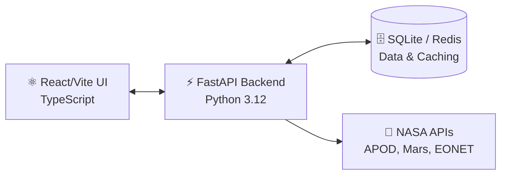

<div align="center">
  <h1>🚀 NASA-Space-Intelligence-Dashboard
</h1>
  <p><strong>A comprehensive, production-ready full-stack application for aggregating and exploring NASA API data.</strong></p>
  
  
  
  
  
  
  
</div>

---

## 📖 Project Overview

**SpaceToday** is a modern web application designed to provide users with a daily space intelligence briefing. Built as an engineering assessment for DECTIFY, it aggregates data from multiple NASA APIs to allow authenticated users to explore:
- 🌌 **Astronomy Pictures of the Day (APOD)**
- 🔴 **Mars Rover Photos**
- ☄️ **Near-Earth Asteroids**
- 🌍 **Earth Observatory Natural Event Tracker (EONET)**

Users can securely log in, view the dashboard, and save their favorite space intelligence to a personalized database.

## 🏗️ Architecture

The application is built using a decoupled client-server architecture with swappable caching and robust database modeling.



---

## 🛠️ Setup & Installation

### Environment Variables
Before running the application, you must configure the backend environment. Copy the example environment file:

```bash
cp backend/.env.example backend/.env
```
*(Ensure `NASA_API_KEY` is set. You can use `DEMO_KEY` for light testing).*

### Option 1: Docker Compose (Recommended)
The easiest way to spin up the entire stack (Frontend, Backend, and Redis Cache) is via Docker Compose:

```bash
docker compose up --build
```
- **Frontend App:** [http://localhost:3000](http://localhost:3000)
- **Backend API:** [http://localhost:8000](http://localhost:8000)
- **Interactive API Docs (Swagger):** [http://localhost:8000/docs](http://localhost:8000/docs)

### Option 2: Local Development (Manual)
If you prefer to run the services natively without Docker:

**Backend Setup:**
```bash
cd backend
python -m venv venv
source venv/bin/activate  # Windows: `venv\Scripts\activate`
pip install -r requirements.txt
python -m uvicorn main:app --reload
```

**Frontend Setup:**
```bash
cd frontend
npm install
npm run dev
```

---

## 📡 API Endpoints Overview

The backend exposes a fully documented OpenAPI specification available at `/docs`. Core domains include:

- 🔐 **Authentication:** `POST /api/auth/signup`, `POST /api/auth/login`, `POST /api/auth/refresh`, `POST /api/auth/logout`, `GET /api/auth/me`
- 🛰️ **Space Feeds:** `GET /api/space/apod`, `GET /api/space/asteroids`, `GET /api/space/mars-photos`, `GET /api/space/earth-events`
- 📊 **Dashboard Aggregation:** `GET /api/space/dashboard`
- ⭐ **Favorites:** `POST /api/favorites/`, `GET /api/favorites/`, `DELETE /api/favorites/{id}`
- 💓 **System Health:** `GET /api/health`

---

## 🧪 Testing & Coverage

The backend utilizes `pytest` and `pytest-asyncio` for comprehensive unit and integration testing. The suite strictly validates authentication logic, token rotation, cache abstractions, database isolation, and dashboard partial-failure states.

To run the test suite and view the coverage report:
```bash
cd backend
pytest app/tests/ -v
pytest app/tests/ --cov=app --cov-report=term-missing
```
> **Note:** Current Backend Test Coverage is **82%**, with **46** passing tests.

---

## 💎 Technical Highlights

### 1. Dual-Token Authentication Strategy
Security is prioritized using a dual-token JWT architecture. Short-lived Access Tokens are stored securely in React state memory, while long-lived Refresh Tokens are issued as `HttpOnly`, `Secure` cookies. This mitigates XSS attack vectors and allows for seamless, silent background token rotation.

### 2. Swappable Cache Strategy
The cache layer implements the **Strategy Pattern** via an abstract `CacheProvider`. By default, it operates using a zero-dependency `MemoryCacheProvider`. However, when a `REDIS_URL` is detected in the environment (e.g., when launched via Docker), the application dynamically swaps to a `RedisCacheProvider`, immediately unlocking horizontal scaling and distributed caching.

### 3. Asynchronous Aggregation & Partial-Failure Handling
The `/api/space/dashboard` endpoint requires data from four distinct external NASA APIs. Instead of executing these sequentially, the application leverages `asyncio.gather(*tasks, return_exceptions=True)`.
If an upstream API (such as APOD) returns a 503 error, the backend gracefully catches the exception, logging a warning but returning a `{"error": "Service unavailable"}` object. The React frontend intercepts this state and renders a localized alert, ensuring the dashboard remains highly available and functional.

---

## 📝 Design Report
For an in-depth, 500+ word explanation of the technical decisions, database architecture, testing strategies, and future roadmap improvements, please review the [DESIGN_REPORT.md](./DESIGN_REPORT.md).
